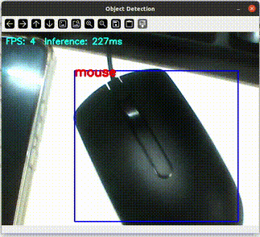

# 🔍 Real-Time Object Detection

This project demonstrates **real-time object detection** using a **quantized MobileNet SSD model** with **TensorFlow Lite** and **OpenCV**.

Designed for cross-platform use (Linux, Windows, embedded boards like NXP i.MX8M Plus), it supports **hardware acceleration** via delegates like **NPU or GPU**.

---



---

## 📁 Project Structure

```
.
├── detect.py                      # Main object detection script  
├── labels.py                      # Label mapping (class index to name)  
├── ssd_mobilenet_v1_quant.tflite  # Quantized TFLite model  
├── README.md                      # This documentation
```

---

## 🧠 Model Information

- **Model**: SSD MobileNet V1 (Quantized)  
- **Format**: TensorFlow Lite (`.tflite`)  

✅ Optimized for edge devices  
🧠 Compatible with NPU delegate (`libvx_delegate.so`) on platforms like i.MX8MP

---

## ✅ Dependencies

Install with:

```bash
pip install opencv-python pillow tflite-runtime
```

### Requirements:
- Python 3.6+
- OpenCV – for video stream processing
- Pillow – for image handling
- TFLite Runtime – for inference
  
### 🔎 Note  
The `opencv-python` package automatically installs the latest version of **NumPy** that is compatible with your Python version.  
However, this program (or one of its dependencies) requires **NumPy version 1.x**, because modules compiled against NumPy 1.x may crash when used with NumPy 2.x or later.

To fix this issue, downgrade NumPy by running:  
```bash
pip install "numpy<2.0"
```
---

## 🚀 How to Run

### 1️⃣ Run with CPU:

```bash
python main.py
```
### 2️⃣ Run with NPU/GPU delegate:

```bash
python main.py -d path/to/libvx_delegate.so
```

> ✅ Ensure `libvx_delegate.so` exists on your device.

### 3️⃣ Use a different camera or video file:

```bash
# Use camera index X
python main.py -i X

# Use a video file
python main.py -i path/to/video.mp4
```
---

## 📝 Label Mapping (`labels.py`)

This file maps class indices to human-readable labels:

```python
label2string = {
    0: 'person',
    1: 'car',
    2: 'bicycle',
    3: 'motorcycle',
    4: 'airplane',
    5: 'bus',
    # Add more as needed
}
```

> 🔁 Make sure these match the classes used in your `.tflite` model.

---

## 🎯 Output

- 🟥 Bounding boxes  
- 🏷️ Class labels  
- 📈 FPS (frames per second)  
- ⏱️ Inference time per frame  

### 📟 Console Output Example

```text
Detection: (84, 130)-(210, 310) Label: person
FPS: 26  Inference: 15ms
```

### 🖼️ Display

- A window shows the annotated video stream in real time.
- Press **`q`** to quit.

---

## ⚙️ Internal Processing Flow

1. Initialize video source (camera or file)
2. Load TFLite model (with or without delegate)
3. Preprocess frame (resize to 300×300)
4. Run inference
5. Postprocess:
   - Parse output tensors
   - Draw bounding boxes
   - Map class indices to labels
6. Display frame with FPS and timing
7. Repeat until exit

---

## 💡 Tips

- ✅ Use **quantized models (uint8)** for better hardware compatibility
- 🚀 For NXP i.MX8MP, use **`libvx_delegate.so`** to run on the NPU
- 📏 Adjust input size/resolution to balance accuracy and performance
