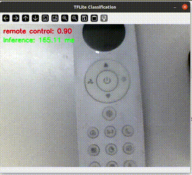

# 🔍 Real-Time Image Classification

This project demonstrates **real-time image classification** using a **quantized MobileNetV1 classification model**  with **TensorFlow Lite** and **OpenCV** for **single-label image classification**.

Designed for cross-platform use (Linux, Windows, embedded boards like NXP i.MX8M Plus), it supports **hardware acceleration** via delegates like **NPU or GPU**.

---



---

## 📁 Project Structure

```
.
├── main.py                         # Your main script (e.g., live camera inference)
├── label_image.py                  # Image classification script for static images 
├── labels.py                       # Label mapping (class index to name)  
├── ssd_mobilenet_v1_quant.tflite   # Quantized TFLite model  
├── README.md                       # This documentation
```

---

## 🧠 Model Information

- **Model**: MobileNetV1 classification model  (Quantized)  
- **Format**: TensorFlow Lite (`.tflite`)  

✅ Optimized for edge devices  
🧠 Compatible with NPU delegate (`libvx_delegate.so`) on platforms like i.MX8MP

---

## ✅ Dependencies

Install with:

```bash
pip install opencv-python tflite-runtime
```

### Requirements:
- Python 3.6+
- OpenCV – for video stream processing and display
- TFLite Runtime – for inference

### 🔎 Note  
The `opencv-python` package automatically installs the latest version of **NumPy** that is compatible with your Python version.  
However, this program (or one of its dependencies) requires **NumPy version 1.x**, because modules compiled against NumPy 1.x may crash when used with NumPy 2.x or later.

To fix this issue, downgrade NumPy by running:  
```bash
pip install "numpy<2.0"
```
---

## 🚀 How to Run

### 1️⃣ Run with CPU:

```bash
python main.py
```
### 2️⃣ Run with NPU/GPU delegate:

```bash
python main.py -d path/to/libvx_delegate.so
```

> ✅ Ensure `libvx_delegate.so` exists on your device.

### 3️⃣ Use a different camera or video file:

```bash
# Use camera index X
python main.py --camera_id X

# Use a video file
python main.py --camera_id path/to/video.mp4
```
---

## 📝 Label Mapping (`labels.txt`)

This file maps class indices to human-readable labels:

```text
   background
   tench
   goldfish
   great white shark
   tiger shark
   # Add more as needed
```

> 🔁 Ensure these labels correspond exactly to the classes your .tflite model was trained on, so that predictions map correctly to meaningful names.

---

## 🎯 Output

- 🏷️ Top predicted class labels with confidence scores
- ⏱️ Inference time per frame (in milliseconds)
- 📤 Console prints showing predicted labels and scores in real-time 

### 📟 Console Output Example

```text
0.953214: golden retriever 
Inference: 23.45 ms
```

### 🖼️ Display

- A window showing the video stream annotated with predicted class labels and their confidence scores
- Inference time displayed on the video frame
- Press **`q`** to quit.

---

## ⚙️ Internal Processing Flow

1. Initialize video source (camera or file)
2. Load TFLite classification model(with or without delegate)
3. Capture frame from video source
4. Preprocess frame (resize to 224×224)
5. Run inference on the preprocessed frame
6. Postprocess output:
   - Extract top predicted classes and confidence scores 
   - Map class indices to labels
7. Display annotated frame with  predicted labels and inference time
8. Repeat until exit

---

## 💡 Tips

- ✅ Use **quantized models (uint8)** for better hardware compatibility
- 🚀 For NXP i.MX8MP, use **`libvx_delegate.so`** to run on the NPU
- 📏 Adjust input size/resolution to balance accuracy and performance
