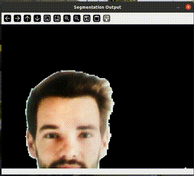

# 🔍 Real-Time Selfie Segmenter

This project demonstrates **real-time selfie segmenter** using a **quantized TFLite model**  with **TensorFlow Lite** and **OpenCV**.

Designed for cross-platform use (Linux, Windows, embedded boards like NXP i.MX8M Plus), it supports **hardware acceleration** via delegates like **NPU or GPU**.

---



---

## 📁 Project Structure

```
.
├── main.py                            # Your main script (e.g., live camera inference)
├── selfie_segmenter_int8.tflite       # Quantized TFLite model  
├── selfie_segmenter_landscape.tflite  # Quantized TFLite model optimized for landscape input orientation  
├── README.md                          # This documentation
```

---

## 🧠 Model Information

- **Model**: Selfie Segmentation Model (Quantized)  
- **Format**: TensorFlow Lite (`.tflite`)  

✅ Optimized for edge devices  
🧠 Compatible with NPU delegate (`libvx_delegate.so`) on platforms like i.MX8MP

---

## ✅ Dependencies

Install with:

```bash
pip install opencv-python tflite-runtime
```

### Requirements:
- Python 3.6+
- OpenCV – for video stream processing and display
- TFLite Runtime – for inference

### 🔎 Note  
The `opencv-python` package automatically installs the latest version of **NumPy** that is compatible with your Python version.  
However, this program (or one of its dependencies) requires **NumPy version 1.x**, because modules compiled against NumPy 1.x may crash when used with NumPy 2.x or later.

To fix this issue, downgrade NumPy by running:  
```bash
pip install "numpy<2.0"
```
---

## 🚀 How to Run

```bash
python main.py
```
> ✅ Ensure `libvx_delegate.so` exists on your device.If the delegate .so is missing, script will raise an error and stop.
---

## 🎯 Output

- 🖼️ Real-time binary segmentation mask where white regions represent foreground (e.g., person) and black represents background

### 🖼️ Display

- A window titled "Segmentation Output" showing the live video segmentation mask
- White areas correspond to detected foreground; black areas correspond to background
- Press **`q`** to quit.

---

## ⚙️ Internal Processing Flow

 1. Initialize video capture from the default camera device
 2. Load the TensorFlow Lite segmentation model with NPU delegate for acceleration
 3. Continuously capture frames from the camera
 4. Preprocess each frame by converting color format (BGR to RGB), resizing to model input size, and normalizing pixel values
 5. Run inference on the preprocessed frame to generate a segmentation mask
 6. Postprocess the output mask by resizing it back to the original frame size and applying a threshold to create a binary mask
 7. Generate a segmentation visualization by combining the binary mask with foreground and background colors
 8. Display the segmentation mask window in real-time
 9. Repeat until exit 

---

## 💡 Tips

- ✅ Use **quantized models (uint8)** for better hardware compatibility
- 🚀 For NXP i.MX8MP, use **`libvx_delegate.so`** to run on the NPU
- 📏 Adjust input size/resolution to balance accuracy and performance
