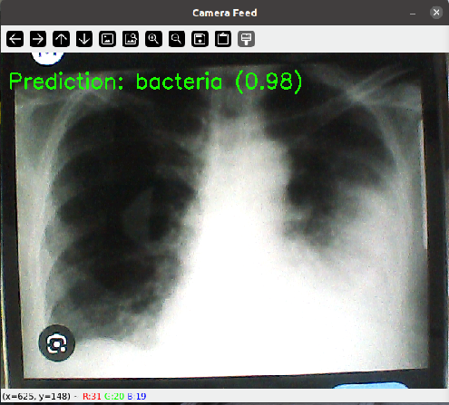

# 🔍 Real-Time Pneumonia Detection

This project demonstrates **real-time pneumonia detection** using a **quantized TFLite model**  with **TensorFlow Lite** and **OpenCV**.

Designed for cross-platform use (Linux, Windows, embedded boards like NXP i.MX8M Plus), it supports **hardware acceleration** via delegates like **NPU or GPU**.

---



---

## 📁 Project Structure

```
.
├── main.py                            # Your main script (e.g., live camera inference)
├── trained.tflite                     # Quantized TFLite model  
├── README.md                          # This documentation
```

---

## 🧠 Model Information

- **Model**: Pneumonia Detection Model (Quantized)  
- **Format**: TensorFlow Lite (`.tflite`)  

✅ Optimized for edge devices  
🧠 Compatible with NPU delegate (`libvx_delegate.so`) on platforms like i.MX8MP

---

## ✅ Dependencies

Install with:

```bash
pip install opencv-python tflite-runtime
```

### Requirements:
- Python 3.6+
- OpenCV – for video stream processing and display
- TFLite Runtime – for inference

### 🔎 Note  
The `opencv-python` package automatically installs the latest version of **NumPy** that is compatible with your Python version.  
However, this program (or one of its dependencies) requires **NumPy version 1.x**, because modules compiled against NumPy 1.x may crash when used with NumPy 2.x or later.

To fix this issue, downgrade NumPy by running:  
```bash
pip install "numpy<2.0"
```
---

## 🚀 How to Run

```bash
python detect.py
```
> ✅ Ensure `libvx_delegate.so` exists on your device.If the delegate .so is missing, script will raise an error and stop.
---

## 🎯 Output

- 🏷️ Top predicted class labels with confidence scores
- 📤 Console prints showing predicted labels and scores in real-time

### 📟 Console Output Example

```text
Input details: [ 1 96 96  3]
Output details: 0.00390625 Zero point: -128
Camera feed started. Press 'q' to quit.
Failed to capture frame. Exiting...
```

### 🖼️ Display

- A window titled "Camera Feed" shows the live video with predicted class label and confidence score
- Press **`q`** to quit.

---

## ⚙️ Internal Processing Flow

1. Initialize video source (camera or file)
2. Load TFLite classification model with NPU delegate for acceleration
3. Retrieve input and output tensor details (shape, dtype, quantization parameters)
4. Continuously capture frames from the live camera feed
5. Preprocess each frame:
   - Resize to match model input dimensions
   - Convert color format from BGR to RGB
   - Add batch dimension and cast to required data type
6. Set the preprocessed frame as input tensor and invoke the interpreter
7. Retrieve output tensor and apply dequantization using scale and zero-point
8. Identify the class with the highest confidence and extract prediction details
9. Overlay the predicted class label and confidence score on the video frame
10. Display the annotated frame in a window titled "Camera Feed"
11. Repeat until exit

---

## 💡 Tips

- ✅ Use **quantized models (uint8)** for better hardware compatibility
- 🚀 For NXP i.MX8MP, use **`libvx_delegate.so`** to run on the NPU
- 📏 Adjust input size/resolution to balance accuracy and performance
