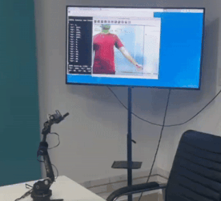
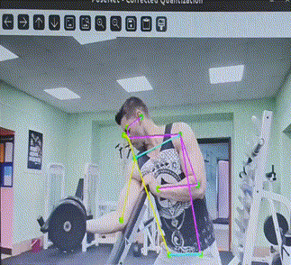

# 🔍Pose Estimation (Multi person Detection)
 
----
## 🖼️ Demo Output

<p align="center">
  
  
</p>

---
* Bounding boxes around detected persons
* 17 Keypoints with lines connecting joints
* FPS display during video mode
---
 
# Pose Estimation with Two TFLite Models
 
This project demonstrates **real-time human pose estimation** using two TensorFlow Lite models:
 
1. `SSD MobileNet v1` for **person detection**,
2. `Pose ResNet` for **keypoint estimation**.
 
## 📸 Input → 👤 Detection → 🤸 Pose Estimation
 
---
 
## 📚 Table of Contents
 
* [Prerequisites](#prerequisites)
* [Installation](#installation)
* [Project Structure](#project-structure)
* [Usage](#usage)
  * [Image Mode](#image-mode)
  * [Video Mode](#video-mode)
* [Models](#models)
 
 
---
 
## 🔧 Prerequisites
 
* Python 3.8+
* OpenCV
* NumPy
* TFLite Runtime
 
Install dependencies using:
 
```bash
pip install -r requirements.txt
```
 
 
---
 
## 📦 Installation
 
Clone this repository
 
Make sure the models are present in the directory. If not, they will be downloaded automatically.
 
---
 
## 📁 Project Structure
 
```
pose-estimation-two-model/
│
├── pose.py                                 # Main script
├── const.py                                # Keypoint indices
├── labels.py                               # COCO label mapping
├── pose_resnet_util.py                     # Pose keypoint processing
├── ssd_mobilenet_v1_quant.tflite           # TFLite object detection model
├── pose_resnet_50_256x192_int8.tflite      # TFLite pose model (INT8)
├── angle_calculations.py                   # roarm utils 
├── roarm.py                                # roarm main file 
├── util/
│   ├── utils.py
│   ├── image_utils.py
│   ├── model_utils.py
│   ├── log_init.py
│   └── ... (other helpers)
└── __pycache__/                  # Python cache files
```
 
---
 
## ▶️ Usage
 
### 📷 Image Mode
 
Run pose estimation on an image:
 
```bash
python pose.py -i path_to_input_image.jpg -s output_image.png
```
 
### 📹 Video Mode (webcam or video file)
 
Use webcam:

Roarm:
```bash
python roarm.py -v 0 -d /usr/lib/libvx_delegate.so
```

Pose-Detection:
 
```bash
python pose.py -v 0
```
 
Use video file:
 
```bash
python pose.py -v path_to_video.mp4 -s output_video.mp4
```
 
 
### 🕶️ Run on NPU
 
```bash
python pose.py -v 0 --delegate /usr/lib/libvx_delegate.so 
```
 
---
 
## 🧠 Models
 
| Model Name                             | Task                | Framework     |
| -------------------------------------- | ------------------- | ------------- |
| ssd\_mobilenet\_v1\_quant.tflite       | Person detection    | TFLite (INT8) |
| pose\_resnet\_50\_256x192\_int8.tflite | Keypoint Estimation | TFLite (INT8) |
 
---
