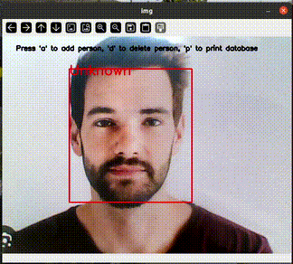

# 🔍Real-Time Face Detection and Recognition 

This project demonstrates **real-time face detection and recognition** using a **quantized TFLite model**  with **TensorFlow Lite** and **OpenCV** and enhanced with **voice commands** using **Whisper (OpenAI)** and **Text-to-Speech**.

Designed for cross-platform use (Linux, Windows, embedded boards like NXP i.MX8M Plus), it supports **hardware acceleration** via delegates like **NPU or GPU**.

---



---

## 📁 Project Structure

```
.
├── face_database.py                  # Handles storing and finding faces
├── face_detection.py                 # Detects faces in images
├── face_recognition.py               # Creates face features for recognition
├── main.py                           # Main face detection and recognition script  
├── facenet_512_int_quantized.tflite  # Quantized TFLite model 
├── yoloface_int8.tflite              # Quantized TFLite model 
├── README.md                         # This documentation
```

---

## 🧠 Model Information

**Face Detection Model**

- **Model**: YOLO Detection Model (Quantized)  
- **Format**: TensorFlow Lite (`.tflite`)  

**Face Recognition Model**

- **Model**: Facenet Model (Quantized)  
- **Format**: TensorFlow Lite (`.tflite`) 

✅ Optimized for edge devices  
🧠 Compatible with NPU delegate (`libvx_delegate.so`) on platforms like i.MX8MP

---

## ✅ Dependencies

Install with:

```bash
pip install opencv-python tflite-runtime pyttsx3
pip install git+https://github.com/openai/whisper.git
apt install alsa-utils ffmpeg
```

### Requirements:
- Python 3.6+
- OpenCV – for video stream processing and display
- TFLite Runtime – for inference
- Pyttsx3 - for Text-to-Speech
- Whisper - for Speech-to-Text(OpenAI Model)
- ALSA Utils – For audio recording and playback
- FFmpeg - Required by Whisper to handle audio format conversion

### 🔎 Note  
The `opencv-python` package automatically installs the latest version of **NumPy** that is compatible with your Python version.  
However, this program (or one of its dependencies) requires **NumPy version 1.x**, because modules compiled against NumPy 1.x may crash when used with NumPy 2.x or later.

To fix this issue, downgrade NumPy by running:  
```bash
pip install "numpy<2.0"
```
---

## 🚀 How to Run

### 1️⃣ Run with CPU:

```bash
python main.py
```
### 2️⃣ Run with NPU/GPU delegate:

```bash
python main.py -d path/to/libvx_delegate.so
```

> ✅ Ensure `libvx_delegate.so` exists on your device.

### 3️⃣ Use a different camera or video file:

```bash
# Use camera index X
python main.py -i X

# Use a video file
python main.py -i path/to/video.mp4
```
---
## 🎮 Controls

| Key      |             Action                                |
| ---------| --------------------------------------------------|
| `v`      | Start voice command recording                     |
| `q`      | Quit the program                                  |
| `1-9`    | Select a number to remove a face (when prompted)  |

---
## 🎤 Voice Workflow

| Command    |	             Behavior                        |
| ---------- | --------------------------------------------- |
| `add`      | Detect face → Record name → Confirm → Store   |
| `remove`   | List known faces → Say number or name         |
| `quit`     | 	Exit gracefully                              |

---
## 🎯 Output

- 🔲 Detected face region(s) highlighted with red bounding boxes in real time.
- 🧠 Recognized face name (if matched in database) is displayed above the bounding box.
- 🗣️ System greets the recognized person with a voice message using TTS.
- 🆕 Users can add new faces using voice command ("add" or "new").
- 🗑️ Users can remove known faces using voice command ("remove" or "delete") and confirming by speaking the number or using number keys (1-9).
- 🔤 Name is added by saying the name aloud, and the system confirms with TTS.
- 📁 A face database is stored and updated locally using embeddings (database.npy).
- ❌ If no face is detected or name is not recognized, appropriate voice feedback is given (e.g., "No face detected", "Name not recognized").

### 🖼️ Display

- 👁️ The **main video window** titled **"Face Recognition"** displays:
  - Detected faces with red bounding boxes.
  - Recognized names above each detected face.
  - A help message at the bottom: **"Press 'v' to speak command, 'q' to quit"**.
- 🎛️ A **side panel window** titled **"Side Panel"** shows:
  - Current voice command response (e.g., "Hello Arjun", "Please say the name").
  - Audio recording status (e.g., "Recording started...", "Recording stopped.").
  - List of saved names for removal (when "remove" command is triggered).
- 🎤 Press **"v"** to trigger **voice command input** (e.g., add/remove/quit).
- 🔢 Press a **number key (1-9)** to confirm name removal from the list.
- ❌ If no face is detected, no name is shown and appropriate feedback is spoken.
- ⏹️ Press **"q"** or say **"quit"** to exit the application gracefully.

---

## ⚙️ Internal Processing Flow

1. Initialize video source (camera or file)
2. Load TFLite face detection and recognition models (optionally with delegate like NPU)
3. Initialize face embedding database from file or create a new one if none exists
4. Start capturing frames from the video source
5. Detect face(s) in the frame using the YOLO-based face detector
6. Extract and pad the detected face region (ROI)
7. Generate 512-D embeddings for the face using the Facenet recognizer
8. Match embeddings with stored ones in the database to identify the person
9. Use TTS to greet the recognized person by name
10. Show instructions on the video window: "Press 'v' to speak command, 'q' to quit"
11. On pressing 'v', use Whisper to recognize spoken commands like "add", "remove", or "quit"
12. For "add": capture a face, ask for the name via voice, confirm via voice, and save it to the database
13. For "remove": list saved names, accept a number or name via voice, and remove the person from the database
14. Continuously update the video feed with face bounding boxes, labels, and side panel messages
15. Exit gracefully on pressing 'q' or saying 'quit'.


---

## 💡 Tips

- ✅ Use **quantized models (uint8)** for better hardware compatibility
- 🚀 For NXP i.MX8MP, use **`libvx_delegate.so`** to run on the NPU
- 📏 Adjust input size/resolution to balance accuracy and performance
