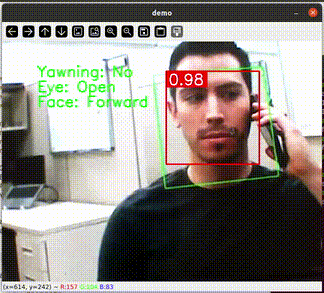

# 👁️ Driver Monitoring System
 
A real-time face, eye, and iris landmark detection system using fully integer-quantized TensorFlow Lite models. This project supports yawning and eye-closure detection, head pose estimation, and gaze direction tracking.
 
---



---

## 📑 Table of Contents
 
* [Prerequisites](#prerequisites)
* [Installation](#installation)
* [Project Structure](#project-structure)
* [Usage](#usage)
 
  * [Video Mode](#video-mode)
* [Models](#models)
 
---
 
## ✅ Prerequisites
 
Ensure you have the following installed:
 
* Python 3.6+
* `opencv-python`
* `numpy`
* `tflite-runtime` or `tensorflow`

 
Install required dependencies with:
 
```bash
pip install opencv-python numpy tflite-runtime
```
 
 
---
 
## ⚙️ Installation
 
Clone this repository and navigate into the folder
 
Ensure all `.tflite` model files are present in the directory.
 
---
 
## 🗂 Project Structure
 
```
.
├── eye_landmark.py                             # Eye and iris model inference
├── face_detection_front_128_full_integer_quant.tflite   # Face detector model
├── face_detection.py                           # Face detection wrapper
├── face_landmark_192_full_integer_quant.tflite # Face mesh model
├── face_landmark.py                            # Face mesh inference logic
├── iris_landmark_quant.tflite                  # Eye and iris landmark model
├── main.py                                     # Main application entrypoint
└── utils.py                                    # Utility functions (geometry, ratios, etc.)
```
 
---
 
## ▶️ Usage
 
### 🎥 Video Mode (Live Detection)
 
Run the program using your default webcam:
 
```bash
python3 main.py -i /dev/video0
```
 
### 🕶️ Run on NPU
To use a delegate for hardware acceleration (e.g., NPU):
 
```bash
python3 main.py -i /dev/video0 -d /usr/lib/libvx_delegate.so
```
 
> Press `q` to quit the application.
 
---
 
## 🧠 Models
 
### 📦 Model Files (All INT8 TFLite)
 
| Model File                                           | Purpose                                       |
| ---------------------------------------------------- | --------------------------------------------- |
| `face_detection_front_128_full_integer_quant.tflite` | Detects bounding boxes and landmarks of faces |
| `face_landmark_192_full_integer_quant.tflite`        | Provides 3D mesh of the face (keypoint mesh)  |
| `iris_landmark_quant.tflite`                         | Predicts iris landmarks and eye contour       |
 
> These models are pre-trained and quantized for fast inference, even on edge devices.
 
---
 
### 🔍 Features
 
* Yawning detection
* Eye open/closed classification
* Head pose estimation (pitch, yaw, roll)
* Gaze direction (left/right/up/down)
* Wake up alert when eyes are closed 
* Runs efficiently with TFLite quantized models
* Optional NPU/TPU acceleration
